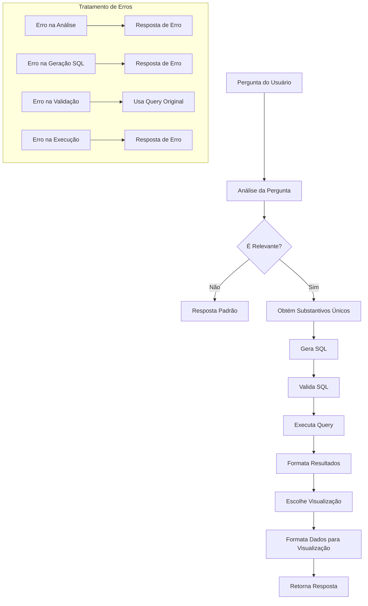

# Text to SQL

> ⚠️ **EM DESENVOLVIMENTO** - Este projeto está em fase de desenvolvimento ativo. Novas funcionalidades e melhorias estão sendo implementadas regularmente.


## Índice
- [Visão Geral](#visão-geral)
- [Arquitetura](#arquitetura)
- [Fluxo de Processamento](#fluxo-de-processamento)
- [Dependências](#dependências)
- [Configuração](#configuração)
- [Uso](#uso)
- [Estrutura do Código](#estrutura-do-código)
- [Estrutura de Pastas](#estrutura-de-pastas)
- [Tratamento de Erros](#tratamento-de-erros)
- [Visualizações](#visualizações)
- [Contribuição](#contribuição)
- [Licença](#licença)

## Visão Geral

O Chat With Data é uma aplicação que permite interagir com dados do BigQuery através de linguagem natural. Utilizando IA generativa e processamento de linguagem natural, o sistema é capaz de:

- Analisar perguntas em português
- Gerar consultas SQL apropriadas
- Executar consultas no BigQuery
- Formatar resultados
- Criar visualizações interativas

## Arquitetura

O sistema é construído com uma arquitetura modular, utilizando os seguintes componentes principais:

- **FastAPI**: Framework web para a API
- **LangChain**: Framework para construção de agentes de IA
- **Google Generative AI**: Modelo de linguagem para processamento de perguntas
- **BigQuery**: Armazenamento e processamento de dados
- **Plotly**: Visualização de dados interativa

## Fluxo de Processamento do Agente



## Dependências

O projeto utiliza as seguintes bibliotecas principais:

| Biblioteca | Versão | Descrição |
|------------|--------|-----------|
| fastapi | 0.68.0 | Framework web para construção da API |
| langchain | 0.1.0 | Framework para construção de agentes de IA |
| google-cloud-bigquery | 3.11.0 | Cliente para acesso ao BigQuery |
| plotly | 5.18.0 | Biblioteca para visualização de dados |
| pandas | 2.0.0 | Manipulação e análise de dados |
| google-generativeai | 0.3.0 | API para o modelo Gemini |
| pydantic | 2.0.0 | Validação de dados |
| uvicorn | 0.15.0 | Servidor ASGI |

## Configuração

1. **Credenciais do Google Cloud**:
   - Coloque o arquivo de credenciais em `credentials/gc-pr-dl-001-2d9103cd4951.json`
   - Configure as variáveis de ambiente necessárias

2. **Configurações do Projeto**:
   ```python
   PROJECT_ID = "gc-pr-dl-001"
   DATASET_ID = "dtl_bl_rag"
   GEMINI_MODEL = "gemini-1.5-pro"
   GEMINI_TEMPERATURE = 0
   ```

## 🚀 Uso

1. **Iniciar o Servidor**:
   ```bash
   python chat_app.py
   ```

2. **Acessar a Interface**:
   - Abra `http://localhost:8000` no navegador
   - Digite sua pergunta no campo de texto
   - Clique em enviar ou pressione Enter


## 📁 Estrutura do Código

O código é organizado em classes principais:

1. **DatabaseManager**:
   - Gerencia conexão com o BigQuery
   - Executa consultas SQL
   - Obtém esquema do banco de dados

2. **LLMManager**:
   - Gerencia interação com o modelo Gemini
   - Processa prompts e respostas
   - Trata erros de comunicação

3. **SQLAgent**:
   - Analisa perguntas
   - Gera consultas SQL
   - Valida e corrige consultas
   - Executa consultas

4. **DataFormatter**:
   - Formata resultados
   - Prepara dados para visualização
   - Escolhe tipo de visualização apropriado

## Estrutura de Pastas

```
chat_with_data/
├── credentials/                    # Credenciais e configurações
│   └── gc-pr-dl-001-2d9103cd4951.json
├── static/                         # Arquivos estáticos
│   ├── css/
│   │   └── styles.css
│   └── js/
│       └── main.js
├── templates/                      # Templates HTML
│   └── index.html
├── chat_app.py                     # Aplicação principal
├── database_manager.py             # Gerenciador de banco de dados
├── llm_manager.py                  # Gerenciador de IA
├── sql_agent.py                    # Agente SQL
├── data_formatter.py               # Formatador de dados
├── requirements.txt                # Dependências
└── README.md                       # Documentação
```

## Tratamento de Erros

O sistema implementa tratamento de erros robusto em várias camadas:

1. **Validação de SQL**:
   - Verifica sintaxe
   - Valida nomes de tabelas e colunas
   - Corrige consultas inválidas

2. **Tratamento de Exceções**:
   - Captura erros de conexão
   - Trata erros de parse JSON
   - Gerencia erros de execução de queries

3. **Fallback Mechanisms**:
   - Usa query original em caso de falha na validação
   - Retorna respostas padrão para erros conhecidos
   - Mantém o sistema funcionando mesmo com falhas parciais

## Visualizações

O sistema suporta vários tipos de visualização:

1. **Gráficos de Barras**:
   - Comparação de categorias
   - Distribuição de dados

2. **Gráficos de Linha**:
   - Tendências temporais
   - Evolução de métricas

3. **Gráficos de Pizza**:
   - Proporções
   - Distribuição percentual

4. **Gráficos de Dispersão**:
   - Correlações
   - Relacionamentos entre variáveis
